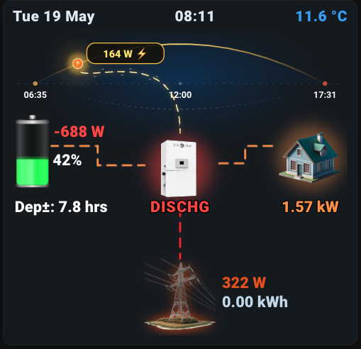

# Hybrid Flow Card

A Home Assistant Lovelace custom card for visualizing solar/battery/grid energy flow with animated power lines, a sun position arc, and battery state-of-charge fill.



## Features

- Live solar position arc with sunrise/sunset times
- Animated power flow lines between PV / inverter / battery / grid / home
- Battery SOC fill bar with colour-coded levels and optional charge bolt animation
- Outdoor temperature with colour banding
- Grid voltage low-warning glow
- Grid import / export detection
- Battery charge / discharge / idle status
- Dark theme, responsive SVG layout

## Installation

### HACS (recommended)

1. Open HACS → Frontend → click the `+` button
2. Search for "Hybrid Flow Card"
3. Click **Install**
4. Add as a Lovelace resource if not auto-added:
   ```
   /hacsfiles/hybrid-flow-card/hybrid-flow-card.js
   ```
5. Add the card to your dashboard (see configuration below)

### Manual

1. Download `hybrid-flow-card.js` into your `config/www/` directory
2. In HA → Settings → Dashboards → Resources → Add Resource:
   - URL: `/local/hybrid-flow-card.js`
   - Type: `JavaScript Module`
3. Refresh the page

### Icons (optional)

Place icon PNGs in `config/www/hybrid_flow/`:
- `home-icon.png` — house icon
- `grid-icon.png` — grid/pylon icon
- `sunsynk.png` — inverter icon

Paths are configurable — see the `home_icon`, `grid_icon`, `inv_icon` options below.

## Configuration

### Visual editor

If supported by your HA version, add the card via the Lovelace UI editor and configure entities through the form.

### YAML

```yaml
type: custom:hybrid-flow-card
pv1_power: sensor.goodwe_pv1_power
pv2_power: sensor.goodwe_pv2_power
pv_total_power: sensor.goodwe_pv_power          # optional — auto-sums pv1+pv2 if omitted/0
grid_active_power: sensor.goodwe_active_power
grid_import_energy: sensor.sunsynk_sunsynk_day_grid_import
consump: sensor.goodwe_house_consumption
battery_soc: sensor.jk_soc
battery_power: sensor.jk_power
grid_voltage: sensor.sunsynk_grid_voltage       # optional — enables red glow on low voltage
outdoor_temp: sensor.gw2000a_v2_1_8_outdoor_temperature
remaining_time: sensor.remaining_time_2          # optional — displayed below battery
sun: sun.sun
full_width: false                                # stretch card to container width
home_icon: /local/hybrid_flow/home-icon.png
grid_icon: /local/hybrid_flow/grid-icon.png
inv_icon: /local/hybrid_flow/sunsynk.png
```

### All configurable keys

| Key | Default | Description |
|-----|---------|-------------|
| `pv1_power` | `sensor.goodwe_pv1_power` | PV string 1 power sensor |
| `pv2_power` | `sensor.goodwe_pv2_power` | PV string 2 power sensor |
| `pv_total_power` | `sensor.goodwe_pv_power` | PV total (auto-sums strings if 0/missing) |
| `grid_active_power` | `sensor.goodwe_active_power` | Grid import/export power |
| `grid_import_energy` | `sensor.sunsynk_sunsynk_day_grid_import` | Daily grid import energy |
| `grid_power_alt` | `sensor.grid_phase_a_power` | Alternate grid power sensor |
| `grid_voltage` | `sensor.sunsynk_grid_voltage` | Grid voltage (enables low-voltage border glow when <200V) |
| `consump` | `sensor.goodwe_house_consumption` | House load sensor |
| `battery_soc` | `sensor.jk_soc` | Battery state of charge |
| `battery_power` | `sensor.jk_power` | Battery power (positive=discharge, negative=charge) |
| `battery_current` | `sensor.jk_current` | Battery current (BMS detail) |
| `battery_voltage` | `sensor.jk_voltage` | Battery voltage (BMS detail) |
| `battery_temp1` | `sensor.jk_temp1` | Battery temperature 1 |
| `battery_temp2` | `sensor.jk_temp2` | Battery temperature 2 |
| `battery_mos` | `sensor.jk_mos` | BMS MOSFET temperature |
| `battery_min_cell` | `sensor.jk_cellmin` | Minimum cell voltage |
| `battery_max_cell` | `sensor.jk_cellmax` | Maximum cell voltage |
| `battery_rem_cap` | `sensor.jk_remain` | Remaining capacity |
| `goodwe_battery_soc` | `sensor.goodwe_battery_state_of_charge` | Fallback battery SOC from inverter |
| `goodwe_battery_curr` | `sensor.goodwe_battery_current` | Inverter-reported battery current |
| `remaining_time` | `sensor.remaining_time_2` | Battery remaining time display |
| `outdoor_temp` | `sensor.gw2000a_v2_1_8_outdoor_temperature` | Outdoor temperature |
| `inv_temp` | `sensor.goodwe_inverter_temperature_module` | Inverter temperature |
| `inv_status` | `sensor.sunsynk_sunsynk_overall_state` | Inverter operational state |
| `sun` | `sun.sun` | Sun entity (for sunrise/set times) |
| `today_pv` | `sensor.goodwe_today_s_pv_generation` | Today's PV generation |
| `today_batt_chg` | `sensor.goodwe_today_battery_charge` | Today's battery charge energy |
| `today_load` | `sensor.goodwe_today_load` | Today's load energy |
| `batt_dis` | `sensor.goodwe_today_battery_discharge` | Today's battery discharge energy |
| `home_icon` | `/local/hybrid_flow/home-icon.png` | Home icon image path |
| `grid_icon` | `/local/hybrid_flow/grid-icon.png` | Grid icon image path |
| `inv_icon` | `/local/hybrid_flow/sunsynk.png` | Inverter icon image path |
| `full_width` | `false` | Set `true` to stretch card across full container |

## Click behaviour

| Element | Short click | Long press |
|---------|------------|------------|
| Date / time | Navigate to `/lovelace/home` | — |
| Temperature | Navigate to `/lovelace/ecowitt` | Open more-info dialog |
| Inverter icon | Navigate to `/lovelace/inverter` | — |
| PV label | Open more-info dialog | — |
| Battery SOC / time / power | Open more-info dialog | — |
| Grid power / icon / import | Open more-info dialog | — |
| Home consumption / icon | Open more-info dialog | — |

## Battery power convention

Uses the Sunsynk convention:
- **Negative** battery power = **charging** (power flows inverter → battery), shown in yellow
- **Positive** battery power = **discharging** (power flows battery → inverter), shown in red
- `< 10 W` deadband shown as idle with neutral colour

The sign is inverted in the display label: charging shows `+XXX W`, discharging shows `-XXX W`.

## Development

```bash
git clone https://github.com/riaangrobler/hybrid-flow-card
```

Edit `hybrid-flow-card.js` and reload HA to test.

## License

MIT
