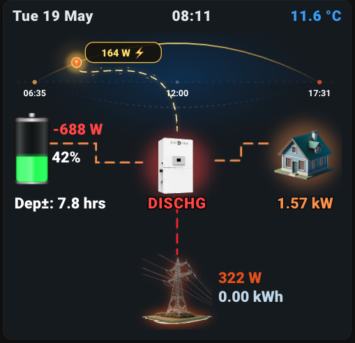

# Hybrid Flow Card

A Home Assistant Lovelace custom card for visualizing solar/battery/grid energy flow with animated power lines, a sun/moon arc, phase-aware moon, and battery state-of-charge fill.



## Features

- Live solar position arc with sunrise/sunset times
- Animated power flow lines between PV / inverter / battery / grid / home
- Battery SOC fill bar with colour-coded levels and optional charge bolt animation
- Phase-aware moon — renders correct crescent/gibbous/full shape, tracks across the night arc
  - Reads `sensor.moon` (HA Moon integration) when configured
  - Falls back to synodic-month calculation if no entity is set
  - `southern_hemisphere: true` mirrors the phase for SH observers
- Outdoor temperature with colour banding
- Grid voltage low-warning glow
- Grid import / export detection
- Battery charge / discharge / idle status
- **10 toggleable sections** — hide/show any visual element via YAML or the visual editor
- Dark theme, responsive SVG layout

## Installation

### HACS (recommended)

1. Open HACS → Frontend → click the `+` button
2. Search for "Hybrid Flow Card"
3. Click **Install**
4. Add as a Lovelace resource if not auto-added:
   ```
   /hacsfiles/hybrid-flow-card/hybrid-flow-card.js
   ```
5. Add the card to your dashboard (see configuration below)

### Manual

1. Download `hybrid-flow-card.js` into your `config/www/` directory
2. In HA → Settings → Dashboards → Resources → Add Resource:
   - URL: `/local/hybrid-flow-card.js`
   - Type: `JavaScript Module`
3. Refresh the page

### Icons (optional)

Place icon PNGs in `config/www/hybrid_flow/`:
- `home-icon.png` — house icon
- `grid-icon.png` — grid/pylon icon
- `sunsynk.png` — inverter icon

Paths are configurable — see the `home_icon`, `grid_icon`, `inv_icon` options below.

## Configuration

### Visual editor

Add the card via the Lovelace UI editor to configure all entity IDs and section toggles through the built-in form — no YAML required.

### YAML (minimal)

```yaml
type: custom:hybrid-flow-card
pv1_power: sensor.your_pv1_power
pv2_power: sensor.your_pv2_power
grid_active_power: sensor.your_grid_power
consump: sensor.your_house_consumption
battery_soc: sensor.your_battery_soc
battery_power: sensor.your_battery_power
```

### All configurable keys

#### Sensors

| Key | Default | Description |
|-----|---------|-------------|
| `pv1_power` | — | PV string 1 power sensor |
| `pv2_power` | — | PV string 2 power sensor |
| `pv_total_power` | — | PV total (auto-sums pv1+pv2 if empty) |
| `grid_active_power` | — | Grid import/export power |
| `grid_import_energy` | — | Daily grid import energy |
| `grid_power_alt` | — | Alternate grid power sensor fallback |
| `grid_voltage` | — | Grid voltage (red border glow when <200 V) |
| `consump` | — | House load sensor |
| `battery_soc` | — | Battery state of charge |
| `battery_power` | — | Battery power (positive=discharge, negative=charge) |
| `goodwe_battery_soc` | — | Fallback battery SOC (GoodWe inverter) |
| `remaining_time` | — | Battery remaining time display |
| `outdoor_temp` | — | Outdoor temperature sensor |
| `solar_radiation` | — | Solar irradiance sensor (W/m²) — displayed below the temperature |
| `sun` | `sun.sun` | Sun entity (for sunrise/set times) |
| `moon_entity` | — | Moon phase entity (e.g. `sensor.moon` from HA Moon integration) |

#### Display

| Key | Default | Description |
|-----|---------|-------------|
| `home_icon` | `/local/hybrid_flow/home-icon.png` | Home icon image path |
| `grid_icon` | `/local/hybrid_flow/grid-icon.png` | Grid icon image path |
| `inv_icon` | `/local/hybrid_flow/sunsynk.png` | Inverter icon image path |
| `full_width` | `false` | Stretch card across full container width |
| `southern_hemisphere` | `false` | Mirror moon phase for southern hemisphere observers |

#### Section visibility

All sections are visible by default. Set any to `false` to hide it permanently.

| Key | Default | Controls |
|-----|---------|---------|
| `show_header` | `true` | Date, time, and temperature bar |
| `show_sky_arc` | `true` | Sky aura, horizon line, arc path, rise/set dots and labels |
| `show_sun` | `true` | Sun disc and glow on the arc |
| `show_moon` | `true` | Moon disc (phase-aware) on the night arc |
| `show_pv` | `true` | PV watt label and animated flow lines from panels |
| `show_battery` | `true` | Battery graphic, SOC %, power, and remaining time |
| `show_grid` | `true` | Grid icon, power value, and import energy |
| `show_inverter` | `true` | Inverter icon, glow, and status label |
| `show_home` | `true` | Home icon, glow, and load value |
| `show_flow_lines` | `true` | All animated dashed flow lines and track paths |
| `show_solar_radiation` | `true` | Solar irradiance value shown below the temperature (hidden if `solar_radiation` entity not set) |

Example — hide the moon and flow lines:

```yaml
type: custom:hybrid-flow-card
pv1_power: sensor.pv1
battery_soc: sensor.batt_soc
battery_power: sensor.batt_power
grid_active_power: sensor.grid_power
consump: sensor.house_load
show_moon: false
show_flow_lines: false
```

## Moon phase

The moon is rendered as a proper crescent/gibbous/full SVG path (not a flat disc).

| Situation | Behaviour |
|-----------|-----------|
| `moon_entity` set and available | Phase read from HA Moon integration state string |
| `moon_entity` not set or unavailable | Phase calculated from synodic month (2000-01-06 reference epoch) |
| `southern_hemisphere: true` | Waxing/waning direction is mirrored |
| Daytime | Moon group hidden; sun shown |
| Night-time | Sun hidden; moon tracks the night arc |

Supported `sensor.moon` states: `new_moon`, `waxing_crescent`, `first_quarter`, `waxing_gibbous`, `full_moon`, `waning_gibbous`, `last_quarter`, `waning_crescent`.

## Click behaviour

| Element | Short click | Long press |
|---------|------------|------------|
| Date / time | Navigate to `/lovelace/home` | — |
| Temperature | Navigate to `/lovelace/ecowitt` | Open more-info dialog |
| Inverter icon | Navigate to `/lovelace/inverter` | — |
| PV label | Open more-info dialog | — |
| Battery SOC / time / power | Open more-info dialog | — |
| Grid power / icon / import | Open more-info dialog | — |
| Home consumption / icon | Open more-info dialog | — |

## Battery power convention

Uses the Sunsynk convention:
- **Negative** battery power = **charging** (power flows inverter → battery), shown in yellow
- **Positive** battery power = **discharging** (power flows battery → inverter), shown in red
- `< 10 W` deadband shown as idle with neutral colour

The sign is inverted in the display label: charging shows `+XXX W`, discharging shows `-XXX W`.

## Development

```bash
git clone https://github.com/HybridRCG/hybrid-flow-card
```

Edit `hybrid-flow-card.js` and reload HA to test. The card uses `customElements.define` guards on both the card and editor registrations, so hot-reload in the browser works without duplicate-registration errors.

## License

MIT
